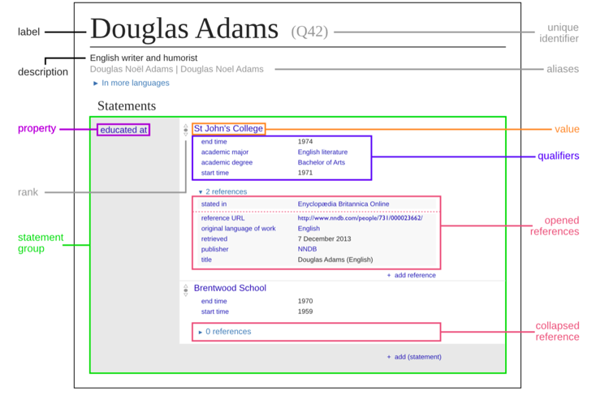

## Wikidata
**Wikidata ist eine zentrale, multilinguale und  offene Plattform zur Speicherung von strukturierten und verlinkten Daten**

Umfrage: [www.menti.com/ale9rvr9hm8y](https://www.menti.com/ale9rvr9hm8y)

* Freie Software und freie Daten (CC 0)
* Offen zur Bearbeitung (Daten und Struktur) für jeden und jede

## Wikidata


## Nutzung in Goobi
* Kann zur Vernetzung mit allen Entitätstypen genutzt werden (Personen, Körperschaften, Orte, "Konzepte", Werke)
* Für Anreicherung des SOLR neuer Normdaten-Parser notwendig (SPARQL/MWAPI)
* Metadatenbank zur Normdatenanreicherung durch  die Crowd. (Eine QID kann jedeR anlegen)

## Wikipedia-Link im Viewer
* Lösung für das  "Problem" ([Community-Thread](https://community.goobi.io/t/wikipedia-verlinkung/218)) der Wiki-Links via Sitelink-Abfrage (async JS)
* Kann auch als Proxy bei GND (oder beliebigem AuthorityFile) für Wikilink dienen
* ```sparql
 SELECT ?wpLink WHERE {
  ?item wdt:P227 "1190920107".
  ?wpLink schema:about ?item;
    schema:isPartOf <https://de.wikipedia.org/>.
}
``` 

## Wer macht mit? 
* Suchfunktionalität im Metadaten-Editor
* Wikipedia-Link im Viewer
* Solr-Anreicherung konfigurierbar je Item-Klasse
