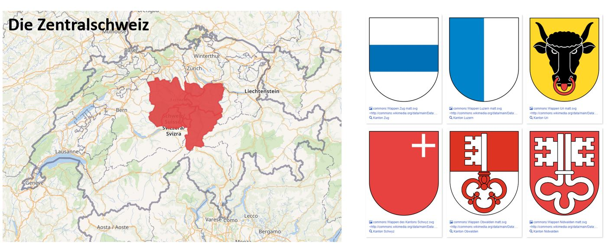
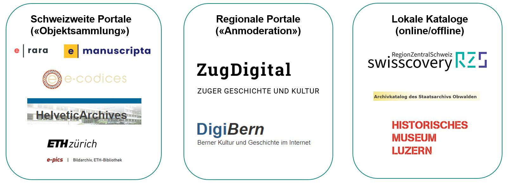
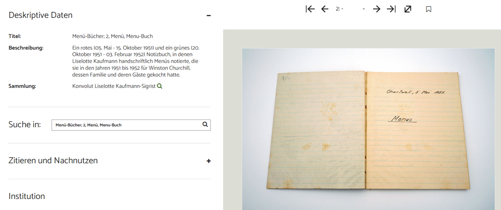
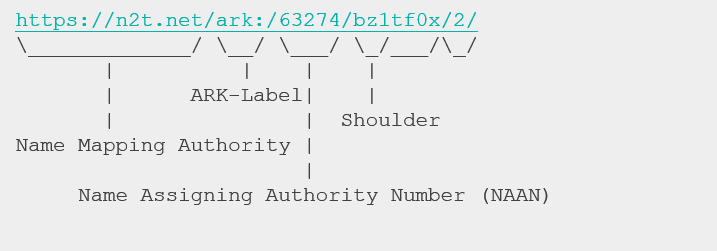
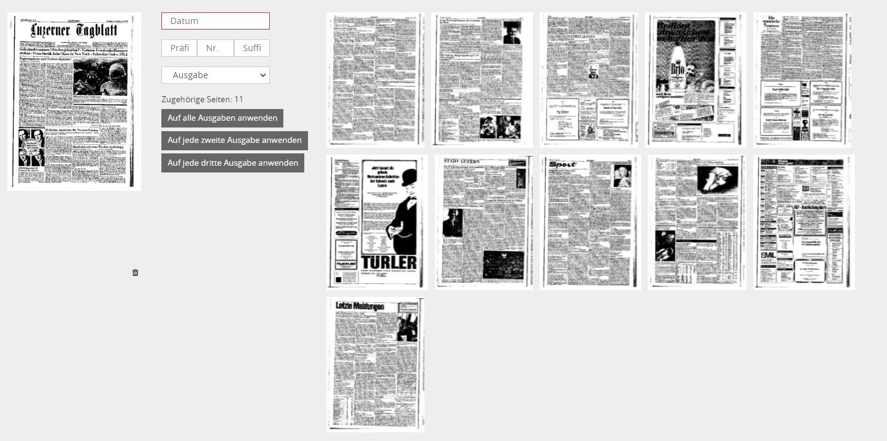
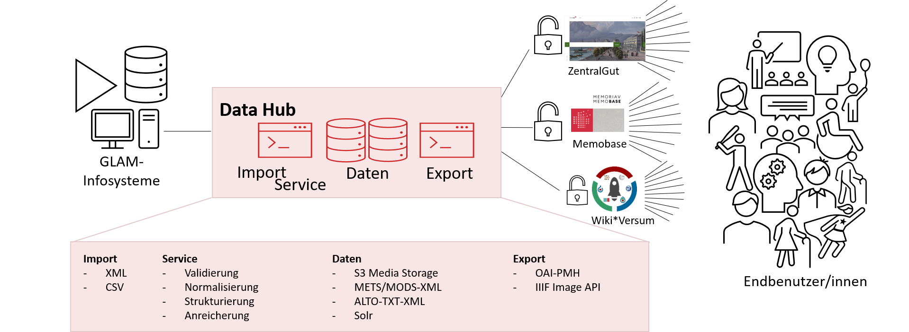
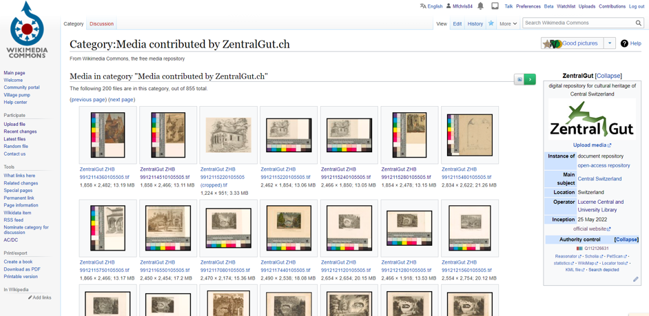

## <small>(Zentral)Schweizer (Portal-)Landschaft</small>
 

## <small>(Zentral)Schweizer (Portal-)Landschaft</small>

* Zentral- und Hochschulbibliothek Luzern
  * Grösste Bibliothek der Zentralschweiz
  * übernimmt bspw. innerhalb von SLSP regionale Koordination
* Aufbau eines kantonsübergreifenden Kulturgutportals
  * Gemeinsamer Raum und Geschichte – getrennte Sammlungen - im Portal vereint
  * Archive, Bibliotheken und Museen personell mit wenig Ressourcen ausgestattet

## <small>(Zentral)Schweizer (Portal-)Landschaft</small>
 

## Wie nutzen wir Goobi?

* Schriften der ZHB Luzern
  * Alte Drucke und Handschriften
  * Zeitungsdigitalisate (Mikrofilmscans)
* Urkunden, Protokolle, Amtsdruckschriften aus den Staatsarchiven
* Bildmaterial
  * Graphiksammlung der ZHB Luzern
  * Glasplatten und Postkartensammlungen
* Videomaterial
* Museale Objekte

## Wie kommt Material nach ZentralGut

* Bibliographie-Import aus Alma
* Import via OAI-PMH (E-Rara, E-Manuscripta)
* Excel-Import
  * Die "kleinen" Partner verfügen nicht über Programme mit standardisierten Schnittstellen
  * Erlaubt Normalisierung der Daten

## Neue Sicht aufs Material
 

## Neu in Workflow - ARK

* Neues Plugin für ARK-Identifier  
  * Dezentral(e Community)
  * Kosten(frei|günstig)
  * Semantik in der PID
  * Seitengenaue Adressierung ist Standard

## Neu in Workflow - Zeitungssplitting

* Automatische Ausgabenerkennung auf S/W erweitert

## Neu in Viewer

* Kommentargruppen
  * Benutzer können zu «Gruppen» zur Bearbeitung von bestimmten Kommentaren (basierend auf SOLR-Queries) berechtigt werden.
* Upload-Formular
  * Benutzer können Material im Viewer hochladen -> mit Anbindung an Goobi Workflow 

## Ökosystem ZentralGut

## Vernetzung – «Portalkreisläufe»

## Selbstgestricktes - nachnutzbar
* Wikimedia Commons Upload mit Open Refine
* [python CLI Mods-Editor](https://gitlab.com/zhbluzern/goobi-pycli-mods-editor) auf xls-Basis
* Zenodo-Upload "public archive"

## Entwicklungswünsche und -pfade
* Wikidata als "Normdatei" einbetten [Präsentation Goobi Days 22](https://zhbluzern.github.io/slides/2022_09_Goobi_Days_Wikidata)
* ARK-Identifier-Service muss übernommen werden
* ... vieles kleineres und grösseres am Viewer