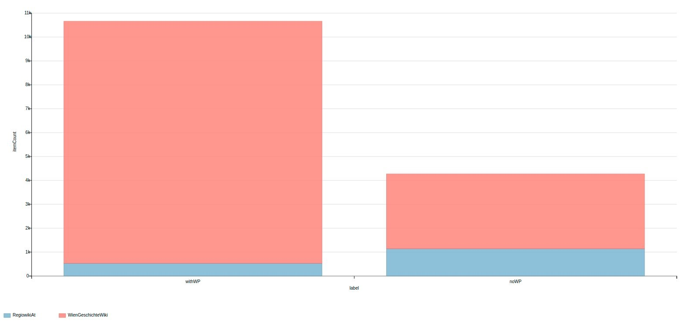
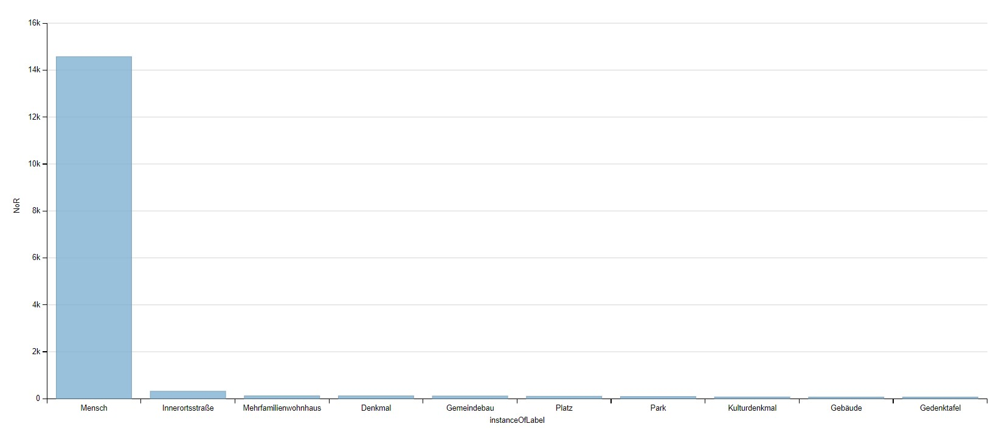
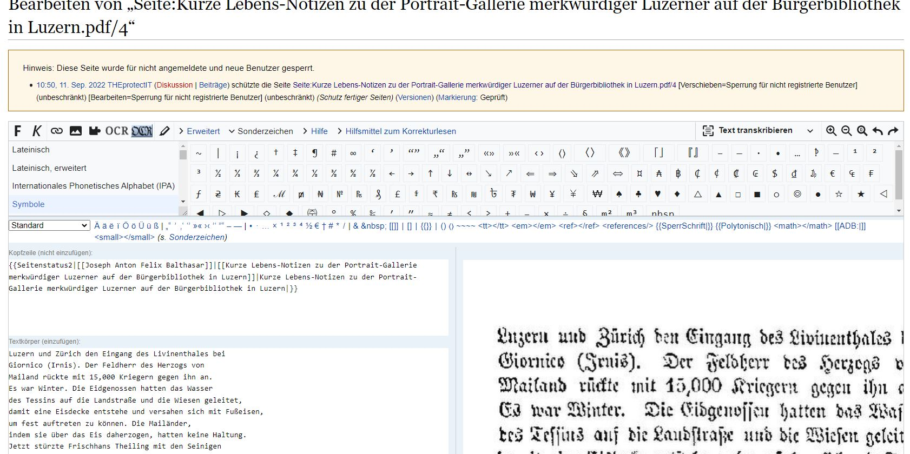
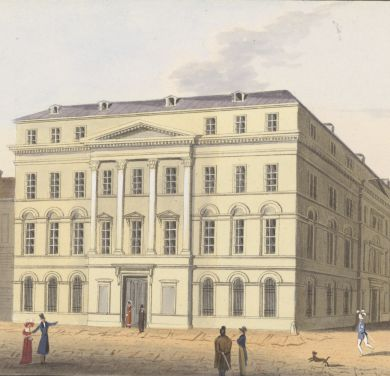

## Wiki für GLAMs
* Das Wien Geschichte Wiki ist ein Glücksfall für die Wiener Gedächtnisinstitutionen
* Kulturgut und "enzyklopädisches Wissen" "the wiki-way" präsentierbar ohne Kompromisse (WP:RK / WD:Notability)

## Wiki und GLAMs - Angstfrage
* Anschlussfrage: Wie viele Artikel hat das WGW die nach WP:RK irrelevant wären? 

## ZHB Luzern und das Wiki*Versum
* "Arbeiten unter Observanz" - mitten in und mit der Community
* Bespielung aller Projekte: Wikipedia, Wikidata, Wikimedia Commons, Wikisource
* "Profitieren von dem was da ist, ergänzen was wir besonderes haben."
* Outreach-Wiki & GLAM-WikiCH-Group: [ZentralGut](https://outreach.wikimedia.org/wiki/GLAM/Case_studies/ZentralGut)

## Wikidatafizierung I
* Vernetzung mit externen Quellen vielfältiger.
* Visualisierung: Direkte Datenübernahme (MWAPI/REST/WDQS)
 * Beispiel: Virtuelle Ausstellung [Porträtgalerie im Katalogsaal der ZHB Luzern](https://zhbluzern.gitlab.io/visualize_portrait_gallery/src/)  Daten via IIIF und Wikidata
 * Familiäre Relationen: Geschwister (Bruder? Schwester?)

## Wikidatafizierung II
* Aktuell > 328.840 WGW Artikel (https://www.geschichtewiki.wien.gv.at/Spezial:Statistik) - korrekt?
* 16.065 Wikidata-Items mit WGW-ID (Personen annähernd komplett?)

## Technik-Wunsch fürs WGW: SPARQL
* Bernhard hat alles gesagt in: Building a Knowledge Graph for the History of Vienna with Semantic MediaWiki (2023) [doi:10.1016/j.websem.2022.100771](https://doi.org/10.1016/j.websem.2022.100771)
* BlazeGraph SPARQL-Endpoint (theroetisch bis 50 Milliarden Tripel, Wikidata aktuell knapp unter 13 Mrd. Performance-Probleme bei komplexen Abfragen merkbar)
* Eigene Wikibase mit Pipeline <-> SMW?

## oder weiter gedacht: WGWikiBase
* Eigene Wikibase-Instanzen bringen bereits viel an Tools mit
  * QuickStatements zum einfachen Massenedit
  * QueryService
  * Arbeiten mit OpenRefine
  * Wikibase erhält aktuell REST-API (leichter extern verwend-/verstehbarbar als MW-API)

## noch weiter gedacht: Alleine bleibt aber alleine
* Die eigene Wikibase, bedeutet alles im Graph auch selbst zu erstellen:
* Bsp. 3600 Geburtsorte ausserhalb Wiens, die wollen modelliert werden: [WDQS Karte aller Geburtstorte von WGW-Personen ausserhalb Wiens](https://w.wiki/7hxq)

## Bibliographie näher heran
* Wikibase als potentielles Katalogreplikat
  * "Template:Cite Q"
* Wikidata-basierte Infobox in Primo (vgl. [Karl Kraus-Box](https://rzs.swisscovery.slsp.ch/permalink/41SLSP_RZS/lim8q1/alma99583590105505))
* Volltextdarstellungen-/bearbeitungen im Wiki -> WikiSource-Extension

## Bildpräsentation
* Wikimedia Commons Ingest [(vgl. ZentralGut)](https://commons.wikimedia.org/wiki/Category:Media_contributed_by_ZentralGut.ch) und Bilder von dort einbinden
* Copyfraud vermeiden:
  * [Datei:Nationalbank Herrengasse.jpg](https://www.geschichtewiki.wien.gv.at/index.php?title=Datei:Nationalbank_Herrengasse.jpg)
  * WGW Lizenz: CC BY-NC-ND 4.0 :-(  // glücklicher in [VL](https://www.digital.wienbibliothek.at/wbrobv/content/titleinfo/2287856)
  * (Tolles Beispiel für Commons-Upload!) 
  

  
## Wikidata-Graph-Schmankerl
* Artikel-Coverage WGW/WP [Abfrage](https://www.wikidata.org/wiki/Wikidata:WikiProject_Austria/WikipediaCoverage_WGW_RWAT)
* Geburtsorte ausserhalb Wiens [Abfrage](https://w.wiki/7hxq)
* WGW als Reference in Wikidata [Abfrage](https://w.wiki/7hyy)
* Verwandschaftsnetz der WGW-Biographien [Abfrage](https://w.wiki/7i7E)
* Ideen, Fragen?