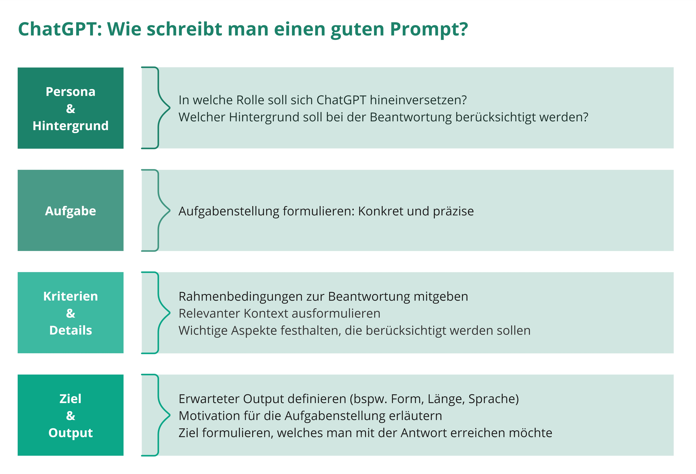

## <small>Ein guter Prompt</small>

## Bildgenerierung mit KI

* In zwei AI-Apps (Dall-E und Leonardo.AI) getestet:
  * "Erzeuge Smileys als einladende Graphik für eine Nutzerumfrage"
  * "the library catalog of the future, neon art, colorful"
  
## Bildgenerierung mit KI

* Dall-E
  * Text-Prompt beschreibt das Bild
  * Ergebnisse im Detail unbrauchbar (wie zB: "Textbausteine", Hände, Gesichter)
  * Unterschied im Prompt de/en

## Coden mit Chat-GPT

* Virtueller Rundgang durch die [Porträtgalerie](https://visualize-portrait-gallery-zhbluzern-33d2b4c7506284a907344ee898.gitlab.io/src/index.html)
* Zahlreiche Skripts für den "täglichen" Gebrauch mit ZentralGut, LORY und Alma mit Chat-GPT gestellt.
* Was gestern eine Google-Recherche auf Stackoverflow gebracht hat, ist heute der Chat-GPT-Chat.

## Coden mit Chat-GPT

* LLMs "können" gut programmieren. (Quellen: Git*, Stackoverflow)
* Je "kleiner" die Aufgabe, desto präziser das Ergebnis.
* Chat-GPT "erklärt" dir seine Beispiele. 
  * So viel wie in den letzten 5 Monaten habe ich schon lange nicht gelernt!
* Vermeide die Übergabe personalisierter Daten
  * eh klar: keine Zugangsdaten
  * keinen rückführbaren Code (der später veröffentlicht wird)

## Links

* Chat-GPT (https://chat.openai.com/)
  * Erstelle ein eigenen Profil: https://github.com/bemattmann/LITanalyzer
  * App mit Chat-GPT entwickelt: [Virtuelle Porträtgalerie](https://visualize-portrait-gallery-zhbluzern-33d2b4c7506284a907344ee898.gitlab.io/src/index.html)
* Graphik-AI
  * DALL-E (https://openai.com/dall-e-2)
  * Leonardo.AI (https://app.leonardo.ai/)